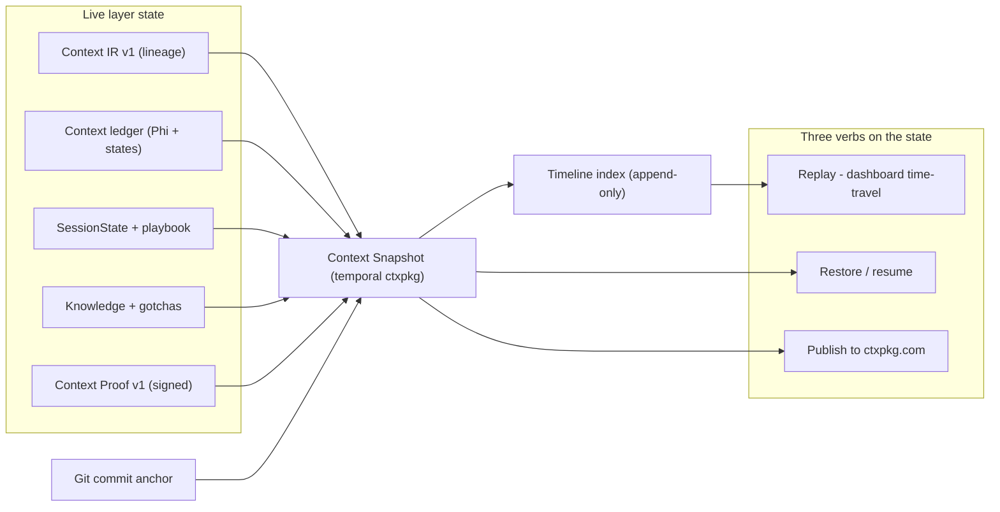

# Context Time Machine

> **North-star concept.** This document defines the positioning, the vision, the
> architecture (built on foundations that already exist in the codebase), and a
> phased roadmap. The GitLab epic and its sub-issues are derived from here.
> No implementation has shipped yet — this is the map, not the territory.

## TL;DR

The state of the context layer — what the model saw, why, what it cost, what it
was allowed to touch, and what it proved — is today **ephemeral and fragmented**.
The Context Time Machine makes that state a **git-anchored, signed, navigable
artifact** (a *Context Snapshot*) and gives it three verbs: **replay**, **restore**,
and **share**. It is not a new pillar bolted onto lean-ctx; it is the **time axis
through the five things lean-ctx already does** — and the first time the discipline
of *context engineering* becomes literally visible.

---

## 1. Positioning — five equal areas, one category

**Token reduction is not played out — it is acute and growing.** "Saturated for
GitHub hype" is not the same as "solved problem": more AI usage means more tokens
means a bigger problem every day. For paying teams the measurable saving is the
concrete ROI — the CFO argument. Compression stays the **foundation**, not
something we leave behind.

**The category is already ours: _the context engineering layer_.** We do not need
to invent a new label. The five areas are **equally important — none dominates**:

| Verb | Area | What it owns |
|------|------|--------------|
| **decides** | Compression / smart I/O | what the model reads |
| **remembers** | Memory architecture | what it learns |
| **guards** | Governance / policy | what it may touch |
| **proves** | Verification / evidence | what it saved, signed |
| **replays** | Time Machine | the temporal view across the other four |

**What is weak today is the narrative, not the substance.** The Time Machine is
not the peak of the stack — it is the **window** onto it. It makes all five areas
visible *at once* and *over time*: each frame shows what was read and compressed
(decides), what was recalled (remembers), what was blocked or redacted (guards),
how much was saved and proven (proves) — all navigable (replays). This is how an
abstract discipline becomes legible, the way flame graphs made performance
observability legible — *without* elevating any single area above the others.

**Token reduction and the Time Machine are linked, not separate.** *"Token savings
are the receipt."* The Time Machine shows that receipt **in motion**: not just
"saved 88%", but "at this commit your agent saw X, which saved Y tokens, here is
the proof, rewind and check." Compression produces the number; the Time Machine
makes it tangible.

## 2. The thesis — what we are really building

lean-ctx is the **enforcement layer** of the Context Stack
([`ECOSYSTEM.md`](../../ECOSYSTEM.md)) — the layer that *live-decides, filters and
manages what the model sees*. The official positioning is four verbs
([`VISION.md`](../../VISION.md), repo description):

> **decides** what they read · **remembers** what they learn · **guards** what
> they touch · **proves** what they save.

The gap: this layer state is **ephemeral and fragmented**. The codebase already
persists dozens of stores and ships many partial exports
([`context_package/`](../../rust/src/core/context_package),
[`savings_ledger/`](../../rust/src/core/savings_ledger),
[`stats/model.rs`](../../rust/src/core/stats/model.rs)) — but there is no unifying
concept for *"the state of the layer at time T."*

**The missing dimension is time.** We turn the layer state into a freezable,
navigable, reproducible, shareable artifact — anchored to git. This is not a sixth
area next to the five; it is the **temporal axis through all five**.

## 3. The vision — the five-verb loop

The vision in one sentence. The five verbs are equal; **replays** closes the loop
and makes the other four visible:

> lean-ctx **decides / remembers / guards / proves** — **and replays**: rewind to
> any commit and see exactly what the model saw, why (which decision / knowledge /
> compression, at what Φ-score), and at what token ROI — then reproduce, resume,
> or share that state.

The loop: decides → remembers → guards → proves → **replays** → back to decides,
now informed by the past.

## 4. Why it fits holistically

This is not a new island. It is the time axis through the subsystems lean-ctx
already runs (*perceive, compress, remember, route, govern*):

- **Perceive / compress** → replay shows *what* the layer chose to surface (read
  modes, entropy filtering, Φ-selection) and how many tokens that saved.
- **Remember** → the snapshot *is* the ultimate memory: the entire layer state,
  not just facts.
- **Route / govern** → replay shows what was blocked, redacted, or budgeted —
  visible policy evidence.
- **Verify** → we reuse the `replay hashes` and proof artifacts that already
  exist; replay is their visible experience.

It also slots into the **Context Stack** as the temporal extension of `ctxpkg`:

- `ctxpkg` today = a *spatial* distillate (knowledge + graph + session + gotchas).
- `ctxpkg` + git anchor + IR lineage + proof = a *temporal* artifact.
- A chain of them = the Time Machine. `ctxpkg.com` = the shareable version history.
- Result: *"git for the context layer"* — in lean-ctx's own vocabulary
  (*distill → seal → publish → verify → enforce*).

## 5. Architecture — on existing foundations

We build almost nothing from scratch. The building blocks already exist:

| Component | File | Role today |
|-----------|------|-----------|
| `ContextIrV1` (`record/save/load`) | [`context_ir.rs`](../../rust/src/core/context_ir.rs) | Live lineage (source, safety, verification, tokens, freshness) of every tool call — already a temporal record of what flowed through the layer. |
| `ContextProofV1` (`write_project_proof`) | [`context_proof.rs`](../../rust/src/core/context_proof.rs) | Signed point-in-time snapshot: project/role/profile identity, ledger summary, evidence receipts, **replay hashes**. |
| Context ledger (Φ-scores + item states) | [`context_ledger.rs`](../../rust/src/core/context_ledger.rs) | The *why* behind the model's view: Candidate / Included / Excluded / Pinned / Stale. |
| Playbook + session diff | [`session/playbook.rs`](../../rust/src/core/session/playbook.rs), [`session_diff.rs`](../../rust/src/core/session_diff.rs) | Incremental checkpoints + state diffing — the frames of the timeline. |
| Container format | [`context_package/`](../../rust/src/core/context_package) | The portable, signed `.ctxpkg` envelope to carry a snapshot. |
| Knowledge timeline | [`ctx_knowledge/mod.rs`](../../rust/src/tools/ctx_knowledge/mod.rs) | An already-temporal view over knowledge. |

What is **missing** — the actual build:

- **Git anchor** — bind each snapshot/frame to a commit SHA + worktree state
  (nothing links these today).
- **Unified Context Snapshot** — one format bundling IR lineage + proof +
  session slice + knowledge + Φ + git anchor in a single `.ctxpkg` extension.
- **Timeline index** — append-only, deterministic ordering of snapshots/events.
- **Replay experience** — dashboard split view (model view ｜ git diff ｜ why/ROI).
- **Restore / resume** — snapshot → rehydrate layer state → agent continues
  seamlessly.

## 6. The artifact: Context Snapshot (temporal `.ctxpkg`)

A **Context Snapshot** is a git-anchored, signed, point-in-time state of the layer:

- **Anchor** — commit SHA, branch, dirty-state hash, time window.
- **What the model saw** — reconstructable MCP instructions + active ledger items
  (Φ, view mode), as *typed items*, not raw text.
- **Why** — decisions, recalled knowledge, compression choices, policy/guard events.
- **ROI** — savings-ledger slice + CEP snapshot for that window.
- **Proof** — `ContextProofV1` with replay hashes (Ed25519-signable).

Doctrine-compliant: **distilled, typed, signed — never raw transcripts**
([`ECOSYSTEM.md`](../../ECOSYSTEM.md)). Deterministic per the output-determinism
contract (no timestamps/counters in bodies; content-addressed).

## 7. The three verbs on the state

- **Snapshot (freeze)** — `lean-ctx snapshot create` / `ctx_snapshot`: freeze the
  layer state at the current commit. Auto-snapshot optionally on git commit hooks
  or session checkpoints.
- **Replay (time-travel)** — dashboard timeline: scrub across commits; per frame a
  split view "model view ↔ git diff ↔ why/ROI". This completes the long-standing
  request for a live decompression UI (side-by-side full vs compressed).
- **Restore / resume + share** — load a snapshot → rehydrate
  session/knowledge/ledger (builds on
  [`ccp_session_bundle.rs`](../../rust/src/core/ccp_session_bundle.rs) +
  [`handoff_ledger.rs`](../../rust/src/core/handoff_ledger.rs)); or publish to
  `ctxpkg.com` as versioned context history.

## 8. Differentiation

We are honest about what others do well (see
[`docs/comparisons/`](../comparisons/vs-headroom.md)); the point below is
structural, not FUD.

- **vs. wire-proxy compressors** — a stateless proxy that compresses a request in
  flight has no persistent, git-anchored state over time. It cannot reconstruct
  *what the model saw three commits ago and why*. Our snapshots can.
- **vs. conversation recorders** — tools that record the **raw conversation**
  violate the Stack doctrine *"distilled, typed, signed knowledge only — never raw
  transcripts."* We store the **distilled, typed, signed state** of what the model
  saw. This is not conversation replay; it is **context replay** — proof-carrying,
  offline-verifiable, privacy-respecting. The constraint becomes the moat.

One-liner: *"Every other tool records the conversation. lean-ctx records the
context — distilled, signed, and replayable. Rewind to any commit and see exactly
what your agent saw, why, and what it cost."*

## 9. Naming

- Experience / feature: **Context Time Machine** (dashboard tab: "Timeline").
- Artifact: **Context Snapshot** (temporal `.ctxpkg`).
- CLI: `lean-ctx snapshot create|list|show|replay|restore|publish`; MCP:
  `ctx_snapshot`.
- Strategic frame: *"ctxpkg goes temporal" / "version control for context."*

## 10. Phased roadmap (→ GitLab epic + sub-issues)

- **Phase 0 — concept & contract**: this document; a `Direction` bullet in
  [`VISION.md`](../../VISION.md) and [`ECOSYSTEM.md`](../../ECOSYSTEM.md); and a
  `CONTEXT_SNAPSHOT_V1` contract extending `CONTEXT_PACKAGE_V1`.
- **Phase 1 — MVP snapshot (headless)**: `lean-ctx snapshot create/list/show` on
  the ctxpkg builder + `context_ir` + `context_proof` + git anchor. Append-only
  timeline index. Deterministic, signable.
- **Phase 2 — replay experience**: dashboard timeline + split view (model view ↔
  git diff ↔ why/ROI), including token ROI per frame. Reuses existing
  dashboard control-plane APIs.
- **Phase 3 — restore / resume**: snapshot → layer rehydration; agent continues
  seamlessly (built on ccp/handoff).
- **Phase 4 — share / publish**: `ctxpkg.com` integration for shareable, versioned
  context history; A2A transport.

## 11. Open decisions & risks

- **Fidelity vs. size** — lightweight (session + knowledge + anchor + proof) vs.
  full (incl. indexes). Recommendation: MVP lightweight, indexes referenced
  optionally (no full copy).
- **Determinism** — must honour the output-determinism contract (no volatile
  fields in bodies).
- **Privacy / redaction** — reuse ccp privacy modes; guard events stay typed,
  never raw content.
- **Retention / storage** — snapshot lifecycle (decay/archive) analogous to the
  memory lifecycle.
- **Auto-snapshot triggers** — git hook vs. session checkpoint vs. manual,
  configurable as policy.

---

*See also: [`VISION.md`](../../VISION.md) ·
[`ECOSYSTEM.md`](../../ECOSYSTEM.md) ·
[`ARCHITECTURE.md`](../../ARCHITECTURE.md)*
